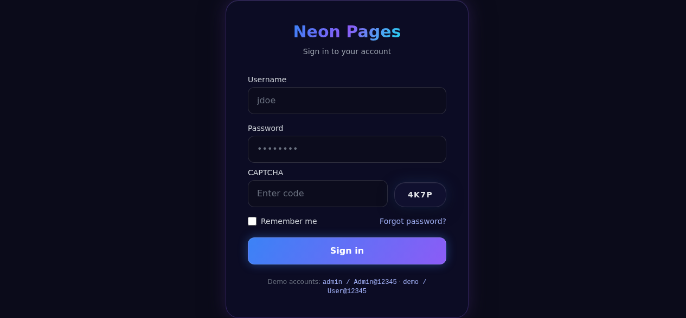
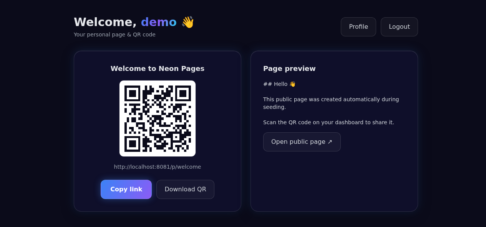
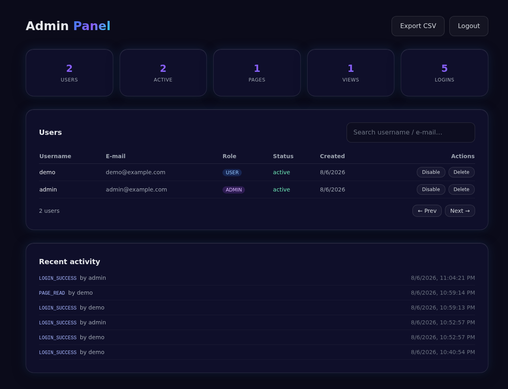
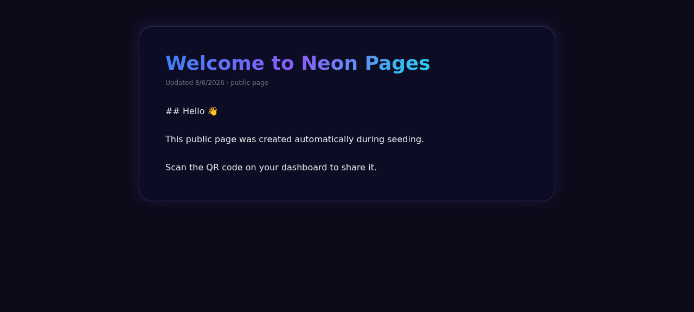

# ⚡ Neon Pages

A **production-grade web application** that lets users create public pages, auto-generate **QR codes**, and download them — with a full **admin panel**, **role-based access control**, and a modern dark **neon / glassmorphism** interface.

Built to the specification in `docs/SPECIFICATION.md`.

---

## 🧰 Tech Stack

| Layer      | Technology                                                              |
|------------|------------------------------------------------------------------------|
| **Frontend** | Next.js 14 (App Router) · React 18 · TypeScript · TailwindCSS · Framer Motion · React Hook Form · Zod · Axios |
| **Backend**  | Node.js · NestJS 10 · TypeScript (strict) · Prisma ORM                  |
| **Database** | PostgreSQL 16                                                           |
| **Auth**     | JWT (access + refresh) · Argon2/bcrypt · HttpOnly secure cookies · rate limiting |
| **Reverse proxy** | Nginx · HTTPS-ready (Let's Encrypt via Certbot)                   |
| **Deploy**   | Docker · Docker Compose · CI/CD (GitHub Actions)                       |

---

## ✨ Features

- **Authentication** — username/password login, JWT access + refresh tokens (rotation), Argon2/bcrypt hashing, secure `HttpOnly` cookies, CAPTCHA, rate limiting & brute-force lockout, audit logging.
- **Roles** — `ADMIN` and `USER`. Admins get the full admin panel; users get a personal dashboard and can change their own password.
- **Admin panel** —
  - **Add new user** — create users and their public page instantly (page URL required); role + hidden password with an **eye show/hide** toggle.
  - **User management** — enable/disable, delete, **reset password** (passwords stay hashed), search/filter/pagination.
  - **Search** — a polished, debounced search box with a clear button (never loses focus while typing).
  - **Page management** — every row shows the user’s public link; clicking it opens a **GUI Markdown page editor** (bold/italic/headings/lists/link toolbar, live preview, SEO fields, publish toggle, and an editable **URL slug** that regenerates the QR code on rename).
- **User dashboard** — welcome, QR code, public link, copy link, download QR (PNG/SVG + hi-res).
- **Public pages** — unauthenticated routes at `/p/{slug}`, created/managed via the admin panel.
- **Security** — SQLi/XSS/CSRF/clickjacking protections, input validation + sanitization, parameterized Prisma queries, security headers, helmet, CORS whitelist.
- **Neon glassmorphism UI** — dark, animated, responsive from 320px→4K, accessible (ARIA, keyboard nav, focus states, contrast).
- **Delivery** — Docker Compose (dev + production), Nginx reverse proxy with HTTPS via Certbot, `scripts/deploy.sh`, CI/CD, full docs.

> **Latest release:** [v1.0.4](https://github.com/starsunali/neon-pages/releases)

---

## 🖼️ Screenshots

Dark, neon, glassmorphism UI across the main screens.

| Login (neon glass panel) | User dashboard (QR code) | Admin panel (stats + users) |
|---|---|---|
|  |  |  |

Public pages are unauthenticated and render at `/p/{slug}`:



---

## 🚀 Quick Start (Docker — recommended)

> **Prerequisites:** Docker & Docker Compose. HTTPS uses the domain in `.env`.

```bash
# 1. Download / clone the repository
git clone https://github.com/<you>/neon-pages.git
cd neon-pages

# 2. Single deployment script (copies env, builds, migrates, seeds, starts everything)
curl -fsSL -o deploy.sh https://raw.githubusercontent.com/<you>/neon-pages/main/scripts/deploy.sh
chmod +x deploy.sh
./deploy.sh

# 3. Or do it manually with Docker Compose
cp .env.example .env
#   ... edit .env (DOMAIN, secrets, db password) ...
docker compose up -d --build
```

- **Dev stack** (with hot reload): `docker compose -f docker-compose.yml up -d --build`
- **Prod stack** (multi-stage images + nginx + HTTPS): `./scripts/deploy.sh`
- **Stop:** `docker compose down` — **reset:** `docker compose down -v` (⚠️ deletes data)

The app is served at `https://$DOMAIN` (or `http://localhost` in dev).

See **[docs/INSTALLATION.md](docs/INSTALLATION.md)** for full Docker-based and manual installation, and **[docs/DEPLOYMENT.md](docs/DEPLOYMENT.md)** for production deployment.

---

## 📦 Repository Layout

```
neon-pages/
├── frontend/          Next.js app (UI, login, dashboards, public pages)
├── backend/           NestJS API (auth, users, pages, qr, audit)
├── nginx/             Reverse-proxy & TLS configuration
├── docker/            Docker auxiliary configuration
├── docs/              All documentation (install, deploy, arch, API, security...)
├── scripts/           Automation (deploy.sh, backup.sh, certbot, healthcheck)
├── tests/             e2e & performance test scaffolding
└── .github/           CI/CD workflows
```

---

## 📚 Documentation

| Doc | Description |
|-----|-------------|
| [docs/INSTALLATION.md](docs/INSTALLATION.md) | Full install: **Docker-based** + default `docker-compose` + manual |
| [docs/DEPLOYMENT.md](docs/DEPLOYMENT.md) | Production deployment, HTTPS, scaling, updates |
| [docs/ARCHITECTURE.md](docs/ARCHITECTURE.md) | System & folder architecture, diagrams |
| [docs/API.md](docs/API.md) | REST API reference (OpenAPI/Swagger) |
| [docs/DATABASE.md](docs/DATABASE.md) | Data model, schema, migrations |
| [docs/SECURITY.md](docs/SECURITY.md) | Security controls & hardening guide |
| [docs/DEVELOPER.md](docs/DEVELOPER.md) | Local dev, code standards, testing |
| [docs/TROUBLESHOOTING.md](docs/TROUBLESHOOTING.md) | Common deployment issues & fixes |
| [docs/QA-REPORT.md](docs/QA-REPORT.md) | QA, security & performance audit baseline |

---

## 🧪 CI/CD

`.github/workflows/ci.yml` runs lint → unit/integration tests → build → Docker build on every push and PR.

---

## 🔐 Security

- Always change the default secrets in `.env` (`openssl rand -base64 48`).
- Frontend origin must be whitelisted in `CORS_ORIGINS`.
- Never commit real `.env` files (see `.gitignore`).

---

## License

Proprietary. © 2026 – All rights reserved.