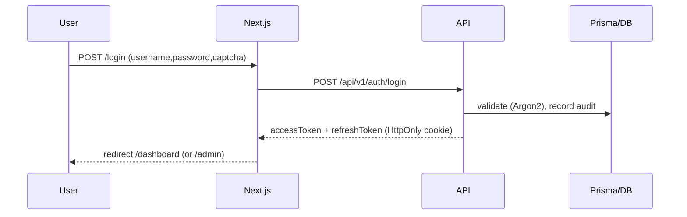

# Architecture

Neon Pages is a **three-tier**, fully containerized web application.

```mermaid
flowchart LR
    U[Browser] -->|HTTPS :80/:443| N[Nginx Reverse Proxy]
    N -->|/api| B[NestJS API :3000]
    N -->|/  /p/{slug}| F[Next.js :3001]
    B -->|Prisma| DB[(PostgreSQL 16)]
    B --> QR[QR files volume]
    F -->|REST /api/v1| B
```

## Stack

| Layer      | Tech | Role |
|------------|------|------|
| Frontend   | Next.js 14 (App Router), React 18, TS, Tailwind, Framer Motion, RHF, Zod, Axios | UI: login, dashboard, admin, public pages |
| Backend    | NestJS 10, Prisma, Passport/JWT, Throttler, Swagger | REST API, auth, security, endpoints |
| Database   | PostgreSQL 16                    | Relational data, FK + indexes, migrations |
| Proxy      | Nginx                         | Reverse proxy, TLS, static, security headers |

---

## Frontend (Next.js)

- **`src/app`** — route-driven pages: `/login`, `/dashboard`, `/admin`, `/p/[slug]`, `/profile`.
- **`src/components`** — `login-form`, `qr-code`, `password-strength`, `animated-background`, `glass-card`, and the neon glassmorphism theme in `globals.css`.
- **`src/lib`** — `api.ts` (Axios with silent 401 refresh), `validators.ts` (Zod schemas), `auth.ts` (session helpers).

Security by default:
- Clickjacking + nosniff + referrer headers set in `next.config.mjs`.
- Zod validation on every form; React Hook Form + zodResolver.
- Access token kept in sessionStorage, sent as `Authorization: Bearer`; refresh token in an **HttpOnly cookie**.

---

## Backend (NestJS)

Modular and dependency-injected (Clean/Onion layering):

```
src/
├── config/        app configuration (env)
├── prisma/        PrismaService (ORM)
├── auth/          strategies (jwt, refresh), guards, DTOs, service
├── users/         admin user management + dashboard stats
├── pages/         user page CRUD + public page serving
├── qr/            QR generation (PNG + SVG)
├── files/         authenticated QR file download (path-traversal protected)
├── audit/         AuditLog write service
├── health/        readiness probe
└── common/        decorators, guards, exception filter
```

### Request / auth flow



- **Access token**: signed JWT, short-lived (`15m`), from the `Authorization` header.
- **Refresh token**: rotation (each use revokes the old one), stored **hashed** in the DB, delivered via a **secure, HttpOnly cookie**.
- Every route is authenticated **by default** (`JwtGlobalGuard`); only `@Public()` routes (login, refresh, health, `/p/{slug}`) are open.

---

## Data model (core tables)

`User` 1—N `Page` · `User` 1—N `RefreshToken` · `User` 1—N `Session` · `User` 1—N `PasswordHistory` · `User` 0—1 `AuditLog` · `LoginAttempt`

Each `Page` belongs to exactly **one** user and exposes a `slug` → public URL `/p/{slug}`. Full schema and SQL in `docs/DATABASE.md`.

---

## Deployment architecture

- **Default `docker-compose.yml`** — full HTTP stack (db + backend + frontend + nginx) for dev / first deploy.
- **`docker-compose.prod.yml`** — production stack: multi-stage Dockerfiles, HTTPS (Certbot), named volumes.
- **Nginx** is the traffic entry point: routes `/api` → backend, everything else → frontend, applies security headers, and terminates TLS.
- **Single script `scripts/deploy.sh`** orchestrates env → secrets → build → migrate → seed → health-check.

## Diagram (folder layout)

```
neon-pages/
├── backend/    NestJS + Prisma + Dockerfile
├── frontend/   Next.js + Tailwind + Dockerfile
├── nginx/      reverse proxy config (HTTP + HTTPS template)
├── docker/     shared compose/Docker helpers
├── docs/       all documentation
├── scripts/    deploy.sh, setup-env.sh, certbot-init.sh, backup.sh, healthcheck.sh
├── tests/      runtime & load test scaffolding
└── .github/     CI/CD
```