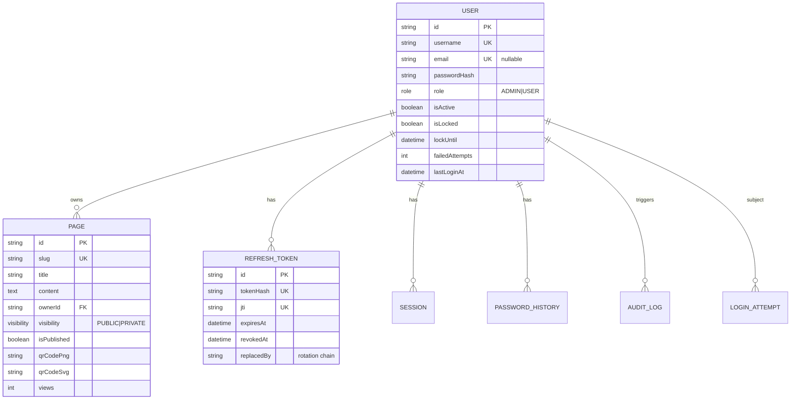

# Database Schema (PostgreSQL · Prisma ORM)

**ORM**: Prisma 5. **Source of truth**: `backend/prisma/schema.prisma` · Migrations in `backend/prisma/migrations/`.

## Entities



## Table map

| Prisma model        | Table               | Notes |
|---------------------|---------------------|-------|
| `User`              | `users`             | Argon2 hash, lock fields |
| `Page`              | `pages`             | 1:1 with owner in this version (unique slug); cascade delete |
| `Session`           | `sessions`          | Active login sessions |
| `RefreshToken`      | `refresh_tokens`    | Hashed at rest, rotation + revocation |
| `LoginAttempt`      | `login_attempts`    | Brute-force detection |
| `AuditLog`          | `audit_logs`        | Full audit trail (JSON metadata) |
| `PasswordHistory`   | `password_history`  | Last 5 hashes, reuse prevention |

## Key design decisions

1. **Foreign keys + cascade rules** — deleting a user cascades to pages, refresh tokens, sessions, password history; audit logs keep the row with `SET NULL` (evidence is never destroyed).
2. **Indexes** — on `username`, `role`, `slug`, `ownerId`, `(username, createdAt)` for attempt scans, `createdAt` for audit reads.
3. **Unique constraints** — `users.username`, `users.email`, `pages.slug`, `refresh_tokens.tokenHash`, `refresh_tokens.jti`.
4. **Soft deletes** — `isActive` on users (disable instead of delete for safety); hard delete available to admins with audit logging.
5. **No raw SQL anywhere** — every query goes through Prisma (parameterized), eliminating SQL injection.
6. **JSON metadata** on audit logs for rich, schema-less context (IP, user agent, diffs).

## Migrations

```bash
cd backend
npx prisma migrate dev --name <change>   # dev: create + apply
npx prisma migrate deploy                # prod: apply pending
npx prisma generate                      # regenerate the client
npx prisma db seed                       # admin/demo users + sample page
```

The migration `20260806000000_init` contains the full initial DDL.

## Seed data

| Username | Role  | Password (default) |
|----------|-------|--------------------|
| `admin`  | ADMIN | `Admin@12345`      |
| `demo`   | USER  | `User@12345`       |

Plus one published sample page `welcome` owned by `demo` (`/p/welcome`).